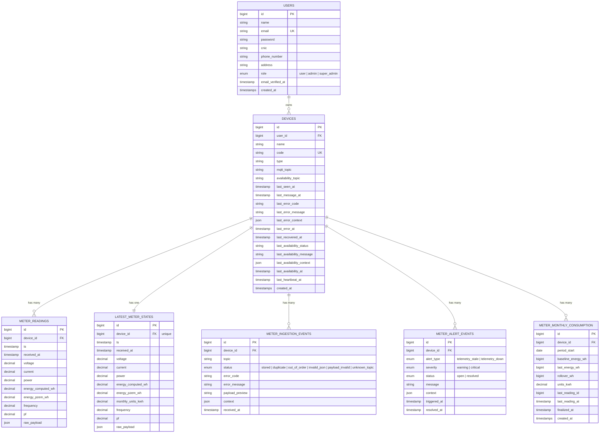

# Entity Relationship Diagram

## Notes

- `LATEST_METER_STATES` is a 1-to-1 cache of the most recent reading per device — exists purely for fast dashboard reads without scanning full history.
- `METER_INGESTION_EVENTS` is an audit log — every MQTT message decision is recorded regardless of outcome (stored, duplicate, invalid, etc.).
- `METER_MONTHLY_CONSUMPTION` holds one row per device per calendar month with the energy consumed ("units", kWh). It is maintained incrementally during ingestion from the cumulative PZEM counter (`baseline → last`, with `rollover_wh` absorbing counter resets). The current month's `units_kwh` is mirrored onto `LATEST_METER_STATES.monthly_units_kwh` for O(1) dashboard reads. Backing data source for the monthly energy report (UC12 / R-1).
- When new device types are added (AC, WMS), a decision is needed: reuse `meter_readings` with nullable columns, or create separate `ac_readings` / `wms_readings` tables.
