# Entity Relationship Diagram

```mermaid
erDiagram
    USERS {
        bigint id PK
        string name
        string email UK
        string password
        string cnic
        string phone_number
        string address
        enum role "user | admin | super_admin"
        timestamp email_verified_at
        timestamps created_at
    }

    DEVICES {
        bigint id PK
        bigint user_id FK
        string name
        string code UK
        string type
        string mqtt_topic
        string availability_topic
        timestamp last_seen_at
        timestamp last_message_at
        string last_error_code
        string last_error_message
        json last_error_context
        timestamp last_error_at
        timestamp last_recovered_at
        string last_availability_status
        string last_availability_message
        json last_availability_context
        timestamp last_availability_at
        timestamp last_heartbeat_at
        timestamps created_at
    }

    METER_READINGS {
        bigint id PK
        bigint device_id FK
        timestamp ts
        timestamp received_at
        decimal voltage
        decimal current
        decimal power
        decimal energy_computed_wh
        decimal energy_pzem_wh
        decimal frequency
        decimal pf
        json raw_payload
    }

    LATEST_METER_STATES {
        bigint id PK
        bigint device_id FK "unique"
        timestamp ts
        timestamp received_at
        decimal voltage
        decimal current
        decimal power
        decimal energy_computed_wh
        decimal energy_pzem_wh
        decimal monthly_units_kwh
        decimal frequency
        decimal pf
        json raw_payload
    }

    METER_MONTHLY_CONSUMPTION {
        bigint id PK
        bigint device_id FK
        date period_start
        bigint baseline_energy_wh
        bigint last_energy_wh
        bigint rollover_wh
        decimal units_kwh
        bigint last_reading_id
        timestamp last_reading_at
        timestamp finalized_at
        timestamps created_at
    }

    METER_DAILY_CONSUMPTION {
        bigint id PK
        bigint device_id FK
        date period_date
        bigint baseline_energy_wh
        bigint last_energy_wh
        bigint rollover_wh
        decimal units_kwh
        bigint last_reading_id
        timestamp last_reading_at
        timestamp finalized_at
        timestamps created_at
    }

    METER_INGESTION_EVENTS {
        bigint id PK
        bigint device_id FK
        string topic
        enum status "stored | duplicate | out_of_order | invalid_json | payload_invalid | unknown_topic"
        string error_code
        string error_message
        string payload_preview
        json context
        timestamp received_at
    }

    ALERT_EVENTS {
        bigint id PK
        bigint device_id FK
        string device_type
        string alert_type "telemetry_stale | telemetry_down | consumption_budget | consumption_daily | consumption_anomaly | threshold_*"
        enum severity "warning | critical"
        enum status "open | resolved"
        string message
        json context
        timestamp triggered_at
        timestamp resolved_at
        timestamp notified_at
    }

    METER_ALERT_SETTINGS {
        bigint id PK
        bigint device_id FK "unique"
        decimal monthly_budget_kwh "null = off"
        int monthly_budget_warn_pct
        decimal daily_budget_kwh "null = off"
        boolean anomaly_enabled
        decimal anomaly_multiplier
        decimal voltage_high "null = off"
        decimal voltage_low "null = off"
        decimal power_max_kw "null = off"
        decimal pf_min "null = off"
        boolean offline_enabled
        timestamps created_at
    }

    METER_THRESHOLD_STATES {
        bigint id PK
        bigint device_id FK
        string check_key "voltage_high | voltage_low | power_max | pf_min"
        int breach_streak
        int clear_streak
        timestamps created_at
    }

    NOTIFICATION_PREFERENCES {
        bigint id PK
        bigint user_id FK "unique"
        boolean mail_enabled
        boolean database_enabled
        boolean broadcast_enabled
        enum min_severity "warning | critical"
        time quiet_hours_start
        time quiet_hours_end
        enum fleet_scope "own | all"
        timestamps created_at
    }

    PENDING_ALERT_NOTIFICATIONS {
        bigint id PK
        bigint user_id FK
        bigint alert_event_id FK
        enum transition "opened | resolved"
        timestamp dispatched_at
        timestamps created_at
    }

    NOTIFICATIONS {
        uuid id PK
        string type
        morphs notifiable "user"
        json data
        timestamp read_at
        timestamps created_at
    }

    USERS ||--o{ DEVICES : "owns"
    USERS ||--|| NOTIFICATION_PREFERENCES : "has one"
    USERS ||--o{ PENDING_ALERT_NOTIFICATIONS : "buffered for"
    USERS ||--o{ NOTIFICATIONS : "receives"
    DEVICES ||--o{ METER_READINGS : "has many"
    DEVICES ||--|| LATEST_METER_STATES : "has one"
    DEVICES ||--o{ METER_INGESTION_EVENTS : "has many"
    DEVICES ||--o{ ALERT_EVENTS : "has many"
    DEVICES ||--o{ METER_MONTHLY_CONSUMPTION : "has many"
    DEVICES ||--o{ METER_DAILY_CONSUMPTION : "has many"
    DEVICES ||--|| METER_ALERT_SETTINGS : "has one"
    DEVICES ||--o{ METER_THRESHOLD_STATES : "has many"
    ALERT_EVENTS ||--o{ PENDING_ALERT_NOTIFICATIONS : "delivered via"
```

## Notes

- `LATEST_METER_STATES` is a 1-to-1 cache of the most recent reading per device — exists purely for fast dashboard reads without scanning full history.
- `METER_INGESTION_EVENTS` is an audit log — every MQTT message decision is recorded regardless of outcome (stored, duplicate, invalid, etc.).
- `METER_MONTHLY_CONSUMPTION` / `METER_DAILY_CONSUMPTION` hold one row per device per calendar month/day with the energy consumed ("units", kWh), maintained incrementally during ingestion from the cumulative PZEM counter (`baseline → last`, with `rollover_wh` absorbing counter resets). The month figure is mirrored onto `LATEST_METER_STATES.monthly_units_kwh`; the daily table is the scalable source for arbitrary-range consumption (`RangeConsumption`), the Daily Breakdown report, and budget/anomaly alerts.
- `ALERT_EVENTS` (renamed from `meter_alert_events`) is the **device-agnostic** alert record. Producers: `meters:scan-health` (stale/down), `alerts:scan-consumption` (budgets/anomaly), `alerts:scan-thresholds` (voltage/power/pf, debounced via `METER_THRESHOLD_STATES` streaks). All emit `AlertOpened`/`AlertResolved`.
- **Delivery pipeline:** transition events → queued listener resolves recipients (device owner + `fleet_scope=all` subscribers) → `PENDING_ALERT_NOTIFICATIONS` buffer → `alerts:dispatch-digests` coalesces per user → `NOTIFICATIONS` (bell) + broadcast + mail, gated by `NOTIFICATION_PREFERENCES` (severity floor, quiet hours).
- `METER_ALERT_SETTINGS` is the per-meter opt-in trigger menu (null field = that trigger off).
- When new device types are added (AC, WMS), a decision is needed: reuse `meter_readings` with nullable columns, or create separate `ac_readings` / `wms_readings` tables. Alerts need no change — `ALERT_EVENTS` is already generic.
