# Use Case Diagram

```mermaid
graph TB
    subgraph Actors
        U([End User])
        A([Admin])
        SA([Super Admin])
        D([IoT Device])
        SYS([System Scheduler])
    end

    subgraph Authentication
        UC1[Register]
        UC2[Login / Logout]
        UC3[Reset Password]
        UC4[Verify Email]
        UC5[Update Profile]
        UC6[Delete Own Account]
    end

    subgraph Device Monitoring
        UC7[View Live Dashboard]
        UC8[View Historical Readings]
        UC9[Filter by Date Range]
        UC10[View Device Health Status]
        UC11[View Availability Status]
    end

    subgraph Reports
        UC12[View Energy Summary - R1]
        UC13[View Detailed Readings - R2]
        UC14[Export CSV]
    end

    subgraph Alerts
        UC15[View Alert History]
        UC16[Receive Email on Device Down]
    end

    subgraph Device Management
        UC17[Register New Device]
        UC18[Edit Device]
        UC19[Delete Device]
        UC20[List Own Devices]
    end

    subgraph Admin Functions
        UC21[View All Users]
        UC22[Create User]
        UC23[Edit User]
        UC24[View All Devices]
        UC25[Delete User]
        UC26[Change User Role]
    end

    subgraph System Background
        UC27[Ingest MQTT Telemetry]
        UC28[Scan Device Health]
        UC29[Fire Alert Event]
        UC30[Broadcast Real-Time Update]
    end

    U --> UC1
    U --> UC2
    U --> UC3
    U --> UC4
    U --> UC5
    U --> UC6
    U --> UC7
    U --> UC8
    U --> UC9
    U --> UC10
    U --> UC11
    U --> UC12
    U --> UC13
    U --> UC14
    U --> UC15
    U --> UC16
    U --> UC17
    U --> UC18
    U --> UC19
    U --> UC20

    A --> UC2
    A --> UC21
    A --> UC22
    A --> UC23
    A --> UC24

    SA --> UC25
    SA --> UC26
    SA --> UC21
    SA --> UC22
    SA --> UC23

    D --> UC27
    SYS --> UC28
    UC28 --> UC29
    UC27 --> UC30
```

## Actor Descriptions

| Actor | Description |
|-------|-------------|
| End User | Homeowner who monitors their own registered devices |
| Admin | Staff who can manage all users and view all devices, but cannot delete users or change roles |
| Super Admin | Full system access — can delete users and change roles |
| IoT Device | Physical hardware (meter, AC, etc.) publishing MQTT messages |
| System Scheduler | Laravel scheduled commands (e.g. `meters:scan-health`) running on cron |

## Implementation Status

| Use Case | Status |
|----------|--------|
| UC1–UC6 Authentication | Done |
| UC7–UC11 Device Monitoring | Done |
| UC12 Energy Summary (R-1) | Not built |
| UC13 Detailed Readings (R-2) | Not built |
| UC14 Export CSV | Not built |
| UC15 Alert History UI | Not built |
| UC16 Email on Device Down | Not built |
| UC17–UC20 Device Management | Done |
| UC21–UC26 Admin Functions | Done |
| UC27–UC30 System Background | Done |
